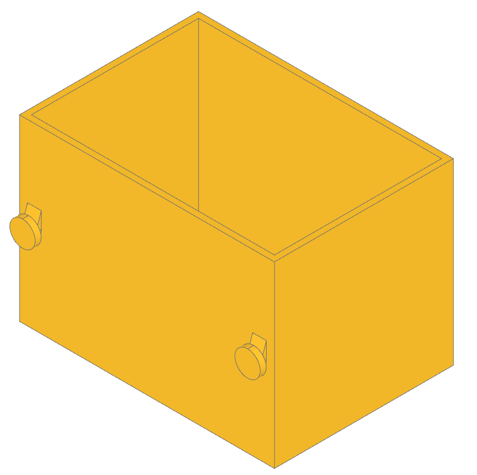
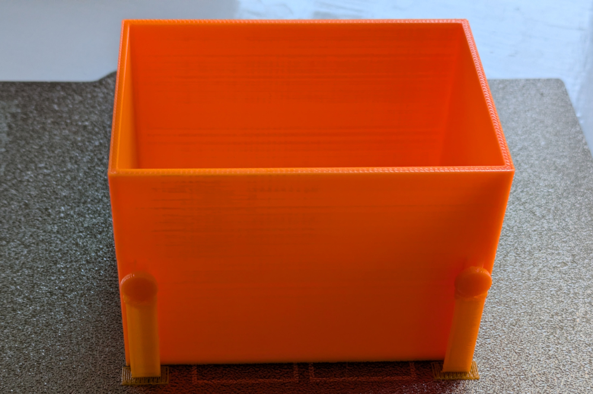
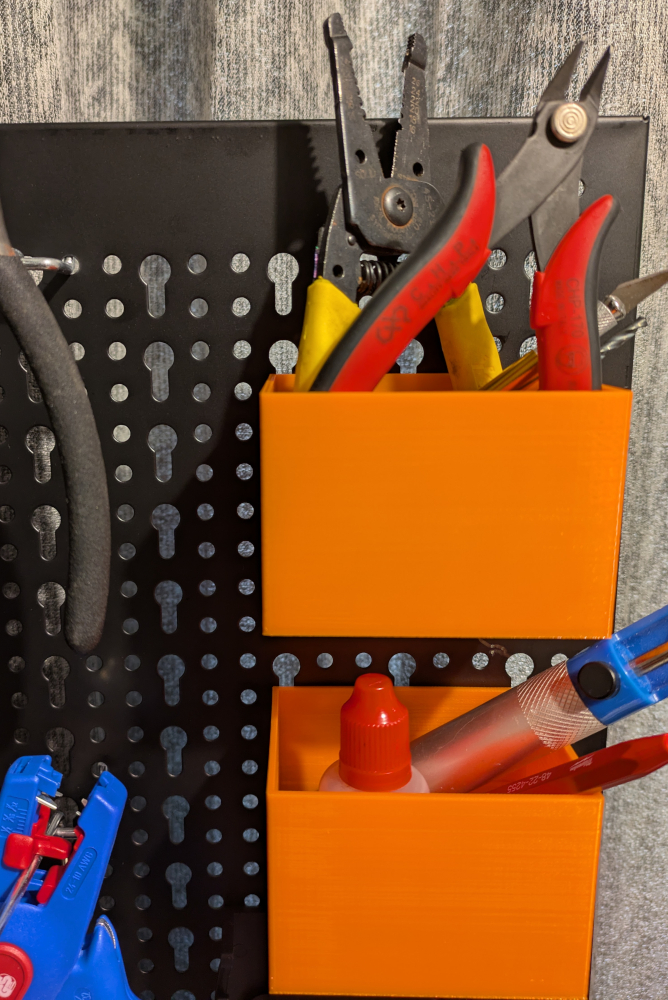

# Pegboard Holders

3D printable pegboard holders for Vonhaus metal pegboard.

Printed with: 0.20mm layer height, with normal support.







## Setup

Create virtual environment:
`python -m venv venv`

Activate and install libraries:
```
. venv/bin/activate
    pip install ocp-vscode
    pip install build123d
```

## Run

Run webserver:

```
. venv/bin/activate
    python -m ocp_vscode
```

Run code:

```
. venv/bin/activate
    python pegboard.py
```
